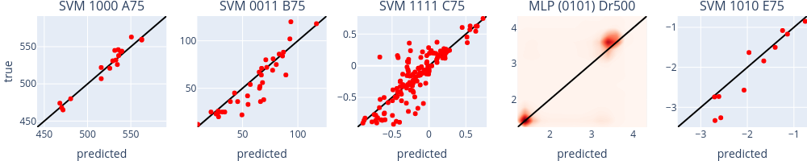

# mutation-prediction

This is a tool for protein mutation effect prediction.
It was developed as part of a bachelor thesis at Forschungszentrum Jülich and RWTH Aachen University.

## Abstract
Enzyme engineering plays a crucial role for industry and research, but the expensive and time-consuming evaluation of mutants in the laboratory limits the number of variants that can be explored.
Therefore, researchers started to investigate the usage of machine learning for predicting enzyme mutation effects.
Many different algorithms and embeddings have been developed in this context.

This work contains a comparison of multiple different embedding strategies and machine learning algorithms.
It was shown that embeddings based on transfer learning improve the accuracy of the predictions across a variety of different proteins.
Both a novel technique for processing multiple sequence alignments with autoencoders and the application of state-of-the-art natural language processing techniques have been investigated.
On the model side, a novel k-convolutional neural network that uses the three-dimensional structure of the protein was developed and compared to the other models.
The application of support vector machines that use transfer learning provided accurate predictions of protein mutation effects.
All hyperparameters have been optimized automatically with distributed computing.

Furthermore, the comparison is accompanied by a thorough sensitivity analysis, which discovered multiple interesting effects, including starting points for further improvements.
Additionally, the effects of various properties inherent to the datasets were investigated.
It was shown that a larger dataset size strongly correlates to higher performance and that the lack of mutants with multiple mutations in the training dataset degrades performance significantly.
Finally, a measure of epistasis was defined and its negative correlation to model performance was shown.
Using the sensitivity analysis, it was demonstrated that the proposed methods can learn some of the epistasis in the dataset.
In conclusion, this work provides multiple contributions to the field which will aid in further improvement of protein mutation effect prediction and its application in industry and research.

## Performance
|dataset                       |training samples|R²    |
|------------------------------|----------------|------|
|Engqvist et al. 2015 (A75)    |              53|0.9534|
|Gumulya et al. 2012 (B75)     |             105|0.7967|
|Wu et al. 2019 (C75)          |             425|0.7364|
|Sarkisyan et al. 2016 (Dr500) |             500|0.6958|
|Cadet et al. 2018 (E75)       |              32|0.8323|

## Thesis
The thesis is not yet published.
